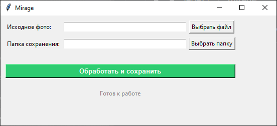

# Mirage

<sub><sup>мой очередной нейрослоп йобнуца. Сделано при поддержке Gemini 3.1 Pro Preview</sup></sub>

Анонимизирует пикчи для различных систем автоматического поиска по типу гугл линзы, яндекс картинок, проверок на уникальность и прочих



## Что он конкретно делает:

1. Удаляет все метаданные
2. Поворачивает на 0.3°, масштабирует на 0.5%, сдвиг на 0.3 пикселя
3. Легкое сглаживание по гауссу
4. Минимальный стохастический шум (сам не ебу че это)
5. Сохраняет в JPEG с качеством 95%

---

## Установка и запуск

```bash
# Клонируем репозиторий
git clone https://github.com/lepex1/mirage.git

# Переходим в папку
cd mirage

# Устанавливаем зависимости
pip install -r requirements.txt

# Запускаем
python main.py
